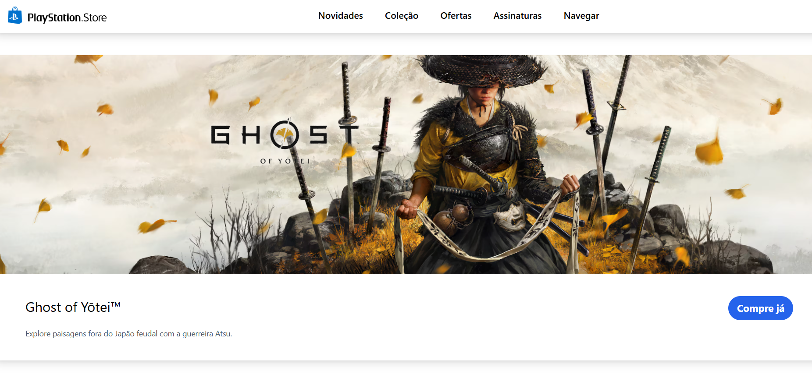

# Réplica PlayStation Store

Desenvolvimento de uma réplica da **PlayStation Store** utilizando Angular, com o objetivo principal de praticar a componentização e consolidar a lógica de aplicações front-end no framework.



## Tecnologias utilizadas

- Angular
- Tailwind CSS

## Funcionalidades implementadas

- Uso de JSON permitiu a renderização dinâmica de jogos, simulando o consumo de dados externos e praticando a iteração eficiente de coleções de dados no Angular.

## Possíveis melhorias

- **Adicionar réplica de elementos chave**: amplementar a réplica do rodapé e da seção "Veja mais" do site original da PlayStation Store para maior fidelidade visual e estrutural.
- **Implementar responsividade**: adaptar o design para garantir a correta visualização e usabilidade em diversos tamanhos de tela (mobile, tablet, desktop).

## Como rodar o projeto localmente
Clone o repositório
```bash
git clone https://github.com/paulotruly/angular_PlayStationCopy/
```
Acesse a pasta do projeto
```bash
cd angular_PlayStationCopy
```
Instale as dependências
```bash
npm install
```
Rode o projeto
```bash
ng serve
```
